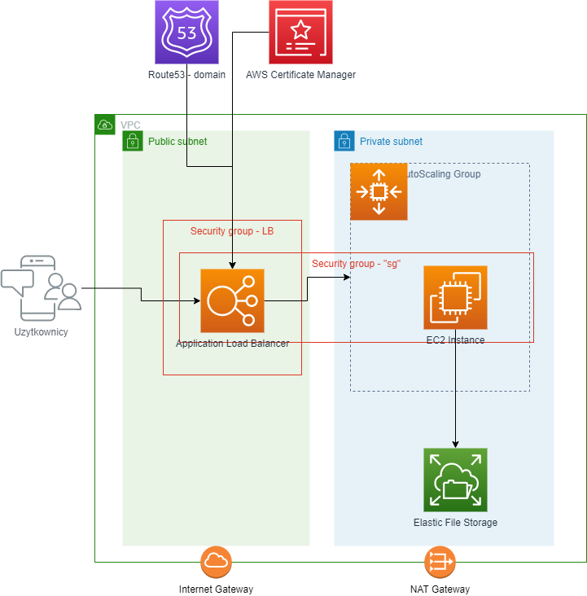

# Plan webinaru ISA

# Budujemy Serwer Jenkinsa



- [Plan webinaru ISA](#plan-webinaru-isa)
- [Budujemy Serwer Jenkinsa](#budujemy-serwer-jenkinsa)
  - [CICD - GitHub Actions](#cicd---github-actions)
  - [Siec](#siec)
    - [Konfiguracja VPC](#konfiguracja-vpc)
    - [Subnets](#subnets)
    - [Internet Gateway](#internet-gateway)
    - [NAT Gateway](#nat-gateway)
    - [Ruting](#ruting)
    - [Security Group - public - dostęp z zewnatrz](#security-group---public---dostęp-z-zewnatrz)
    - [Security Group - private - dostęp pomiedzy EC2 a Load Balancerem](#security-group---private---dostęp-pomiedzy-ec2-a-load-balancerem)
  - [Konfiguracja IAM Role dla serwera Jenkins](#konfiguracja-iam-role-dla-serwera-jenkins)
  - [Konfiguracja EFS](#konfiguracja-efs)
    - [Nowa security group dla EFS](#nowa-security-group-dla-efs)
    - [Utworzenie dysku EFS](#utworzenie-dysku-efs)
  - [Konfiguracja Jenkinsa](#konfiguracja-jenkinsa)
  - [Serwer EC2](#serwer-ec2)
  - [Konfiguracja Amazon Linux 2](#konfiguracja-amazon-linux-2)
    - [Konfiguracja Amazon CloudWatch Agent](#konfiguracja-amazon-cloudwatch-agent)
  - [Konfiguracja Application Load Balancer'a](#konfiguracja-application-load-balancera)
    - [Utworzenie Target Group](#utworzenie-target-group)
    - [Utworzenie Application Load Balancer'a](#utworzenie-application-load-balancera)
    - [Konfiguracja HTTPS dla Application Load Balancera](#konfiguracja-https-dla-application-load-balancera)
      - [Utworzenie certyfikatu SSL w AWS Certificate Manager](#utworzenie-certyfikatu-ssl-w-aws-certificate-manager)
      - [Zarejestrowac record w domenie aws.enterpriseme.academy](#zarejestrowac-record-w-domenie-awsenterprisemeacademy)
      - [Konfiguracja HTTPS na Load Balancerze](#konfiguracja-https-na-load-balancerze)
  - [Konfiguracja AutoScaling Group](#konfiguracja-autoscaling-group)
    - [Budowa AMI](#budowa-ami)
    - [Launch Template](#launch-template)
    - [Auto Scaling Groups](#auto-scaling-groups)


## CICD - GitHub Actions

- Utworzenie dedykowanego repozytorium GitHub
- Utworzenie bucket'u S3 na pliki stanu terraform - 850480876735-demo-tfstate
- Utworzenie IAM Role dla GitHub Actions
  - dedykowany katalog "cicd"
  - przy pomocy terraform tworzymy 
    - IAM Role - github-actions-demo ktora bedzie miala trust relationship z GitHub i naszym repozytorium
    - OpenID Connect (OIDC) identity provider - ustawienie zaufania dla GitHub'a jako autoryzacji roli.
  - logowanie do aws - `aws sso login --profile dor11`
  - ustawienie defaultowego profilu - `export AWS_DEFAULT_PROFILE=dor11`
  - deployment `cd cicd; terraform init; terraform apply`
- Utworzenie GitHub Actions workflow
  - `cd ..; mkdir -p .github/workflows`
  - `touch .github/workflows/terraform.yml`

## Siec

### Konfiguracja VPC

https://eu-west-1.console.aws.amazon.com/vpc/home?region=eu-west-1#vpcs:

VPC musi miec `wlaczone` obie opcje:

* DNS hostnames
* DNS resolution

CIDR - 10.0.0.0/24

### Subnets

* 2 publiczne podsieci, w dwoch różnych AZs (polecam maskę /26 dla każdej sieci)
* 2 prywatne podsieci, w dwoch różnych AZs (polecam maskę /26 dla każdej sieci)

### Internet Gateway

Utworzyć IGW i podłączyć do VPC

### NAT Gateway

* Utworzyć `NAT Gateway w jednej AZ/subnecie`.
* Wybrac Connectivity Type - `Public`
* Zaalokowac Elastic IP

### Ruting

* Dodac NAT gateway jako default route dla subnetow prywatych
* Dodat IGW jako default route dla subnetow publicznych

### Security Group - public - dostęp z zewnatrz

Nazwa: `public`
Ustawiamy tylko reguły `ingress`

* HTTP - port 80, protokół TCP, CIDR 0.0.0.0/0
* HTTPS - port 443, protokół TCP, CIDR 0.0.0.0/0

### Security Group - private - dostęp pomiedzy EC2 a Load Balancerem

Nazwa: `private`
Ustawiamy reguły `ingress` i `egress`

* Ingress
  * Jenkins - port 8080, protokół TCP, CIDR 10.0.0.0/24
* Egress
  * pełny dostęp - wszystkie porty, CIDR 0.0.0.0/0

## Konfiguracja IAM Role dla serwera Jenkins

Aby móc zalogować sie do serwera EC2 przez SSM Session Manager musimy skonfigurować IAM Role oraz IAM Instance Profile a nastepnie podlaczyc tą rolę do naszego serwera.


1. `Create role`
2. Wybieramy `AWS Service` ponieważ nasz rola bedzie używana przez serwis EC2
3. Use case - `EC2`
4. Wybieramy - `EC2 Role for AWS Systems Manager`
   - policy `AmazonSSMManagedInstanceCore` 
   - policy `CloudWatchAgentAdminPolicy`

## Konfiguracja EFS

### Nowa security group dla EFS

Tworzymy nowa security group ktora bedzie pozwalac na komunikacje z serwisem EFS na porcie 2049

https://docs.aws.amazon.com/efs/latest/ug/accessing-fs-create-security-groups.html

Nalezy dodac regule `ingress` pozwalajaca na komunikacji na porcie TCP 2049 (type NFS) wewnatrz naszego VPC

### Utworzenie dysku EFS

https://eu-west-1.console.aws.amazon.com/efs/home?region=eu-west-1#/file-systems

* Stworzyc nowy filesystem
  * Nadac nazwe
  * Wybrac swoj VPC
  * Storage class -> `One Zone`
    * Wybrac Availblity Zone - `eu-west-1a`, `eu-west-1b`
  * Kliknac `Customize`
    * Wylaczyc `Automatic backups` !
  * Pozostale opcje nie zmieniamy, klikamy Next
  * Wybieramy VPC oraz Mount targets
    * Subnet -> private
    * Security Group -> ta w ktorej zezwolilismy na pelny ruch wewnatrz VPC
  * Pomijamy File system policy, Next i Create

##  Konfiguracja Jenkinsa

## Serwer EC2

https://eu-west-1.console.aws.amazon.com/ec2/home?region=eu-west-1

Launch instances

* Wybieramy nazwe dla serwera
* Amazon Linux ->`Amazon Linux 2 AMI (HVM) - Kernel 5.10, SSD Volume Type`
* Architecture -> `64-bit (x86)`
* Instance Type -> `t3.micro`
* Key pair name -> `Proceed without a key pair (Not recommended)`
* Wybieramy swoj VPC oraz jeden z prywatnych subnetow. Auto-assign public IP = `Disabled`
* Select existing security group -> `private` oraz `efs-sg`
* Advanced details 
  * IAM instance profile -> nazwa IAM Role z [02-konifguracja-iam-role.md](02-konifguracja-iam-role.md)
  * Hostname type -> `Resource name`
* Launch instance

## Konfiguracja Amazon Linux 2

**Zastapic fs-xxxxxxxxxxxx EFS ID waszego filesystemu !**

```bash
sudo su -
wget -O /etc/yum.repos.d/jenkins.repo https://pkg.jenkins.io/redhat-stable/jenkins.repo
rpm --import https://pkg.jenkins.io/redhat-stable/jenkins.io-2023.key
yum -y upgrade
yum install -y java-17-amazon-corretto.x86_64
yum install -y jenkins
yum install -y amazon-efs-utils
systemctl daemon-relaod
mkdir -p /var/lib/jenkins
echo "fs-xxxxxxxxxxxx:/ /var/lib/jenkins efs _netdev,noresvport,tls,iam 0 0" >> /etc/fstab
mount -a
df -h
chown jenkins:jenkins /var/lib/jenkins
systemctl enable jenkins
systemctl start jenkins
cat /var/lib/jenkins/secrets/initialAdminPassword
```

### Konfiguracja Amazon CloudWatch Agent

https://eu-west-1.console.aws.amazon.com/systems-manager/parameters?region=eu-west-1#

1. Utworzyć parametr w SSM Parameter Store o nazwie `AmazonCloudWatch-xxxxx` (gdzie xxx zastepujemy np. swoim imieniem)
2. Tier - `Standard`
3. Type - `String`
4. Data type - `text`
5. Value:

```json
{
  "agent":{
    "run_as_user":"root"
  },
  "logs":{
    "logs_collected":{
      "files":{
        "collect_list":[
          {
            "file_path":"/var/log/messages",
            "log_group_name":"messages",
            "log_stream_name":"{instance_id}",
            "retention_in_days":7
          }
        ]
      }
    }
  }
}
```

6. Zalogowac sie na serwer EC2 i skonfigurowac AmazonCloudWatch

```bash
sudo yum install -y amazon-cloudwatch-agent
sudo /opt/aws/amazon-cloudwatch-agent/bin/amazon-cloudwatch-agent-ctl -a fetch-config -m ec2 -s -c ssm:AmazonCloudWatch-xxxxx
```

## Konfiguracja Application Load Balancer'a

### Utworzenie Target Group

- port `8080`
- protocol `HTTP1`
- Health checks:
  - protocol `HTTP`
  - path `/login`
  - success codes `200, 202`
- Rejestracja serwera EC2 do TG

### Utworzenie Application Load Balancer'a

- scheme `Internet-facing`
- IP address type `IPv4`
- dla listener'ow wybieramy publiczne sieci
- security groups
  - odznaczamy grupe `default`
  - wybieramy `private` i `public`
- routing - protocol `HTTP`, port `80` i `Forward to`

### Konfiguracja HTTPS dla Application Load Balancera

#### Utworzenie certyfikatu SSL w AWS Certificate Manager

https://eu-west-1.console.aws.amazon.com/acm/home?region=eu-west-1#/certificates/list

* Utworzyc public certificate dla wybranej przez was domeny
  * Wybrac DNS Validation
* Stworzyc record DNS potrzebny do walidacji certyfikatu
  
#### Zarejestrowac record w domenie aws.enterpriseme.academy

https://us-east-1.console.aws.amazon.com/route53

* Utworzyc rekord CNAME ktory bedzie wskazywal na DNS Name waszego load balancera

#### Konfiguracja HTTPS na Load Balancerze

https://eu-west-1.console.aws.amazon.com/ec2/home?region=eu-west-1#LoadBalancers:

* Wejsc w konfiguracje Load Balancera
* Wybrac Add Listener
  * Listener details
    * HTTPS
    * Action: Forward
    * Wybrac Target Gorup
    * Wlaczyc "Enable group-level stickness"
  * Secure listener settings
    * Wybrac swoj certyfikat z ACM
* Zmienic konfiguracje Listenera "HTTP:80" z Forward na Redirect na port 80

## Konfiguracja AutoScaling Group

### Budowa AMI

* Wylaczyc serwer z ktorego planujemy zrobic obraz
* Zrobic obrac (AMI) o wybranej nazwie
  * Wazne aby `Delete on termination` bylo ustawione na `Enable`
* Poczekaj az obraz bedzie mial status `Available` https://eu-west-1.console.aws.amazon.com/ec2/home?region=eu-west-1#Images:visibility=owned-by-me 

### Launch Template

W przypadku uzywania kodu terraform Launch Template jest juz zrobiony i trzeba tylko zrobic nową wersje z nowym AMI

https://eu-west-1.console.aws.amazon.com/ec2/home?region=eu-west-1#LaunchTemplates:

### Auto Scaling Groups

https://eu-west-1.console.aws.amazon.com/ec2/home?region=eu-west-1#AutoScalingGroups:

* Wejdz do sekcji Auto Scaling Groups i stworz nowa grupe
  * Nadać nazwę
  * Wybrać Launch Template z poprzedniego punktu
  * Wybrać swoje VPC
  * Wybrać prywatny subnet
  * Load Balancing -> `Attach to an existing load balancer`
    * Wybierz swoja Target Group'e
    * Dodaj "ELB" do Health check type
  * Pozostaw standardowe wielkosci 1/1/1 dla Group size
  * Scaling policies - None
